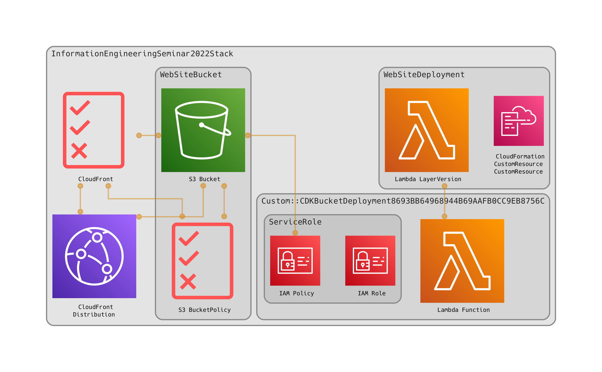

# InformationEngineeringSeminar2022
手話学習用アプリケーション
https://d154egukr4k0ry.cloudfront.net/

## Notion
画面設計などの情報は[Notion](https://www.notion.so/junsei-tamaoki/c5b0974c09b74d19a45ce611cfbdd09b)にあります。
## 手動デプロイ
Reactのビルド→CDK Deploy。.github/workflowにある内容と同じです。
```
cd app
npm i
npm run build
cd ../
cdk deploy
```

## How to work

まず作業の前に、他の人の変更を取り込みます。

```terminal
git pull
```

その後、自分の作業用のコピー(ブランチ)を作成する。半角英数字でわかりやすい名前だと良い。
```terminal
git checkout -b {ブランチ名}
```

なにか作業をした後に、コミット(保存に近いイメージ)をする。
```terminal
git add {変更したファイル}
```
または
```terminal
git add .
```
でコミットするファイルを選択してから、
```terminal
git commit -m "作業内容"
```
コミットしたら、その変更内容を皆に共有(アップロード)する。この作業をgitでは*push*と呼ぶ。
```terminal
git push -u origin {設定したブランチ名}
```
その後、ブラウザ上のGitHubでPull Requestを出す。

作業の流れの例)
```terminal
git pull
git checkout -b add_description

##なにか作業をする。README.mdに変更を加えたとする

git add README.md
git commit -m "アプリケーションの説明を追加"

git push -u origin add_description
```

## what is CDK
CDKは様々な言語でAWSのリソースを管理できるIaCの一種です。今回はドキュメントや記事の充実しているTypeScriptを採用しています。
AWS専用のDockerのようなツールをプログラミング言語で書けるようにしたもの、という理解で概ね良いと思います。
### Development
CDKがインストール済み&AWSの認証情報が設定済みの場合、単に
```shell
cdk deploy
```
とするだけでビルド/デプロイをすべてやってくれます。
AWSの認証情報は.aws/に記述してください。
CDKのインストール方法は任意ですが、CDK v2で開発されていることに注意してください。
デプロイはせず単にコードに誤りがないか確認したい場合は、
```shell
cdk synth
```
を使用してください。

デプロイしたリソースは、ブラウザ上のAWSコンソール上の`CloudFormation > スタック`[^1]で管理/確認することができます。
## Architecture
CDK-Diaからの自動生成。


[^1]:CDKはCloudFormation(以下CFn)のラッパーであるためです。本来のCFnはYAMLでリソースを記述しますが、1から書くと膨大な量になるため、CDKを使って書いています。
ただし、CDKはプログラミング言語で書いたコードをYAMLに変換してCFnとしてデプロイするので、AWSコンソール上ではCFnとして扱われます。
# javascript-graph
# javascript-graph
